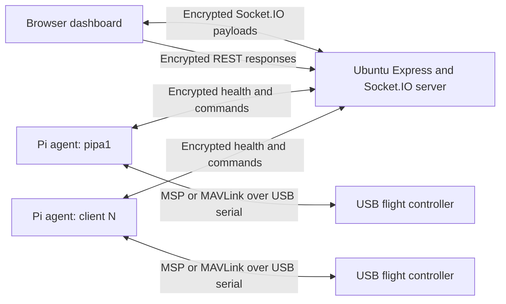
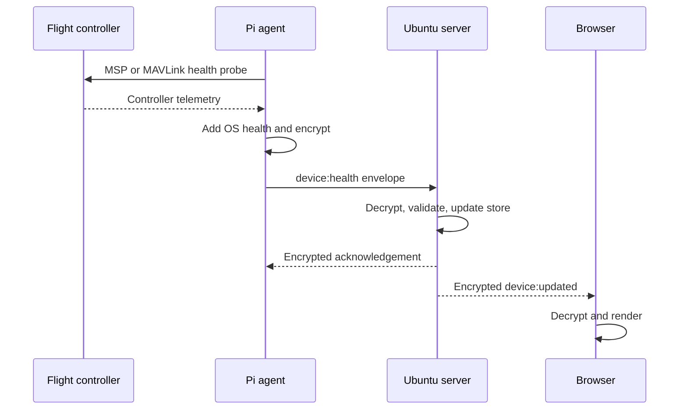
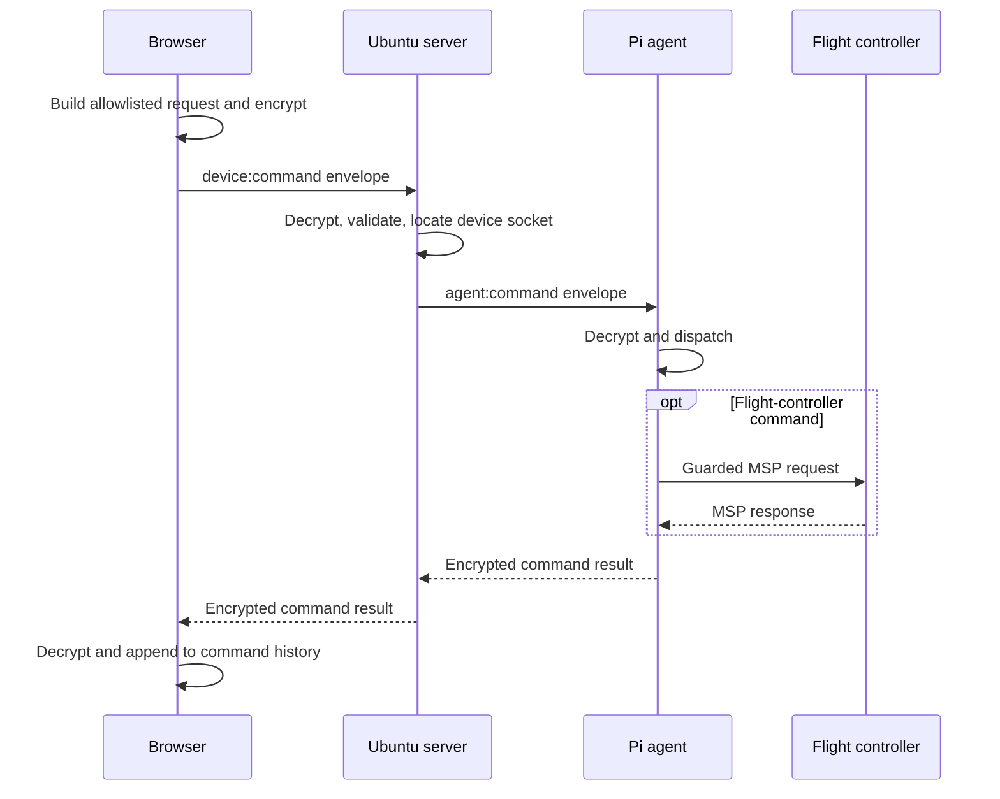

# Pi Dashboard Technical Specification

## 1. Purpose

This document describes the implemented architecture of the project in
`pi/src/dashboard`. The system monitors a fleet of Raspberry Pis from one local
Ubuntu server, displays live Pi and flight-controller health in a browser, and
provides a small allowlist of remote diagnostic and Betaflight motor-test
commands.

This is an implementation specification: it records how the current code works,
how components communicate, how it is deployed, and which safety and security
boundaries exist.

## 2. System scope

The system has four runtime components:

| Component | Location | Responsibility |
| --- | --- | --- |
| Dashboard web application | Ubuntu server/browser | Fleet overview, Pi detail pages, command UI, encrypted payload handling |
| Dashboard server | Ubuntu server | Serves the web build, tracks devices, routes commands, encrypts/decrypts messages |
| Pi health agent | Each Raspberry Pi | Collects Pi health, probes the flight controller, executes allowlisted commands |
| Flight controller | USB serial device attached to a Pi | Exposes Betaflight MSP or MAVLink telemetry; receives guarded Betaflight motor-test values |

There is exactly one Ubuntu server. Any number of Raspberry Pi clients can be
listed in the fleet configuration and deployed over SSH.

The system is local-first:

- no cloud service or external database is required;
- the server holds device state in memory;
- Pi agents reconnect automatically;
- internet access is only needed while initially installing dependencies.

## 3. Logical topology



Socket.IO provides connection management and acknowledgements. Application
payloads are encrypted before they are passed to Socket.IO.

## 4. Source layout

```text
pi/
├── docs/
│   └── dashboard-technical-spec.md
└── src/dashboard/
    ├── agent/                    Pi health agent
    │   ├── python/               MSP/MAVLink integration
    │   └── src/                  Agent runtime and command dispatcher
    ├── config/                   Safe examples and ignored private JSON
    ├── scripts/                  Deployment, installation, and token tools
    ├── server/                   Express and Socket.IO server
    ├── shared/                   Shared contracts and encryption
    ├── web/                      React/Vite dashboard
    ├── package.json              npm workspace and operational commands
    └── README.md                 Operator quick-start guide
```

The npm workspaces are:

- `@pi-health/shared`
- `@pi-health/server`
- `@pi-health/web`
- `@pi-health/agent`

Node.js 20 or newer is required. Node.js 22 is the deployment target.

## 5. Dashboard server

### 5.1 Runtime

The server is an Express application with a Socket.IO server attached to the
same HTTP server. It:

- binds to `0.0.0.0`;
- uses port `3000` unless `PORT` overrides it;
- serves the compiled React application;
- exposes encrypted JSON API responses;
- accepts encrypted health reports;
- broadcasts encrypted fleet snapshots and updates;
- routes encrypted browser commands to the correct Pi connection.

Production starts:

```text
node /opt/pi-health-monitor/server/dist/index.js
```

The systemd service is `pi-health-monitor-server.service`.

### 5.2 Device state

Device state is held in an in-memory `DeviceStore`.

For every device, the store records:

```ts
type DeviceState = {
  health: HealthCheck;
  receivedAt: string;
  socketConnected: boolean;
};
```

The store maintains mappings in both directions:

- device ID to current Socket.IO connection ID;
- Socket.IO connection ID to the device IDs reported through it.

If a device reconnects through a new socket, the new connection replaces the
old mapping. When a socket disconnects, its devices remain in the store but are
marked `socketConnected: false`.

Restarting the server clears the known-device list.

### 5.3 API

The server exposes:

| Endpoint | Encrypted context | Decrypted result |
| --- | --- | --- |
| `GET /api/health` | `api:health` | Server status, timestamp, connected count |
| `GET /api/devices` | `api:devices` | Array of `DeviceState` |
| `GET /api/devices/:deviceId` | `api:device` | One `DeviceState` or encrypted not-found error |

These endpoints return an `EncryptedEnvelope`, not plaintext application JSON.

## 6. Pi agent

### 6.1 Runtime lifecycle

Each Pi runs one `pi-health-agent.service`:

```text
/usr/bin/node /opt/pi-health-agent/dist/index.js
```

On startup the agent:

1. reads configuration from `/etc/pi-health-agent/agent.env`;
2. imports the shared encryption token;
3. connects to the configured server through Socket.IO;
4. sends a health report immediately after connection;
5. sends another report every 60 seconds;
6. waits for encrypted server commands;
7. reconnects indefinitely after network or server interruptions.

Socket.IO reconnection starts at one second and backs off to a maximum of 30
seconds.

### 6.2 Pi health collection

The Node agent uses built-in `node:os` APIs to collect:

- device ID and hostname;
- sample timestamp;
- uptime;
- 1-, 5-, and 15-minute load averages;
- total and free memory;
- platform and CPU architecture;
- agent version;
- non-loopback IP addresses;
- optional flight-controller health.

When `WIFI_INTERFACE` is configured, only addresses from that interface are
reported. Otherwise, all active non-loopback interfaces are included.

### 6.3 Health timing

- Default interval: 60 seconds.
- Minimum accepted configured interval: 1 second.
- Health acknowledgement timeout: 10 seconds.
- The dashboard treats an otherwise connected device as stale when the last
  server receive time is more than 90 seconds old.

The three dashboard states are:

| State | Meaning |
| --- | --- |
| Online | Agent socket connected and report age no more than 90 seconds |
| Stale | Agent socket connected but report older than 90 seconds |
| Offline | Agent socket disconnected |

## 7. Shared data contracts

The canonical TypeScript contracts live in `shared/src/types.ts`.

### 7.1 Health check

```ts
type HealthCheck = {
  deviceId: string;
  hostname: string;
  timestamp: string;
  uptimeSeconds: number;
  loadAverage: number[];
  totalMemoryBytes: number;
  freeMemoryBytes: number;
  platform: string;
  architecture: string;
  appVersion: string;
  ipAddresses: string[];
  flightController?: FlightControllerHealth;
};
```

### 7.2 Command contracts

Browser requests add a target device ID:

```ts
type DeviceCommandRequest = {
  requestId: string;
  deviceId: string;
  command: DeviceCommandName;
};
```

The Pi receives only the request ID and command name. It adds its own device ID
to the result:

```ts
type DeviceCommandResult = {
  requestId: string;
  deviceId: string;
  command: DeviceCommandName;
  success: boolean;
  output: string;
  startedAt: string;
  completedAt: string;
  error?: string;
};
```

Supported command names are:

- `system.info`
- `disk.usage`
- `network.interfaces`
- `processes.top`
- `camera.health`
- `camera.capture`
- `camera.stream.start`
- `camera.stream.stop`
- `camera.stream.status`
- `object-detection.latest`
- `flight-controller.attitude`
- `flight-controller.motor-test.start`
- `flight-controller.motor-test.stop`

Arbitrary command names and arbitrary shell strings are rejected.

## 8. Application message encryption

### 8.1 Token

The server, all Pi agents, and each unlocked browser tab use the same 32-byte
base64url token.

The local source token is stored in:

```text
pi/src/dashboard/config/message-token.json
```

This file:

- is generated with cryptographically secure random bytes;
- is mode `0600`;
- is ignored by Git;
- is not printed during normal deployment;
- is installed into protected systemd environment files.

### 8.2 Encryption envelope

All application payloads use AES-256-GCM through Web Crypto:

```ts
type EncryptedEnvelope = {
  version: 1;
  nonce: string;
  ciphertext: string;
};
```

For every message:

1. a fresh random 96-bit nonce is generated;
2. the payload is wrapped with a random message ID;
3. the event/direction string is supplied as AES-GCM additional authenticated
   data;
4. plaintext and the 128-bit authentication tag are encrypted into
   `ciphertext`;
5. nonce and ciphertext are encoded as base64url.

The authenticated event context prevents a ciphertext created for one message
type from being accepted as another message type.

Each process remembers up to 10,000 successfully decrypted message IDs. A
repeated ID is rejected as a replay.

### 8.3 Encrypted contexts

| Direction/payload | Context |
| --- | --- |
| Pi health report | `device:health` |
| Health acknowledgement | `device:health:acknowledgement` |
| Initial dashboard snapshot | `devices:snapshot` |
| Dashboard device update | `device:updated` |
| Browser command request | `device:command` |
| Browser command result | `device:command:result` |
| Server-to-agent command | `agent:command` |
| Agent-to-server command result | `agent:command:result` |
| REST health response | `api:health` |
| REST device collection | `api:devices` |
| REST device response | `api:device` |

### 8.4 Browser token handling

The browser asks the operator for the shared token before connecting. The token
is kept in `sessionStorage`, so it is limited to the current browser tab and is
removed when the operator selects **Lock**.

The server never sends the token to the browser.

### 8.5 Security boundary and limitations

The application encrypts and authenticates application payloads. It does not
hide:

- Socket.IO framing;
- event names;
- connection timing and message sizes;
- HTTP headers;
- static JavaScript, CSS, or HTML.

HTTPS/WSS is still recommended if transport metadata also needs protection.

Because this design intentionally uses one fleet-wide token:

- any holder of the token can decrypt fleet messages;
- there is no per-device revocation;
- rotating the token invalidates every Pi and browser session;
- the server and all clients must be redeployed together after rotation.

## 9. Message flows

### 9.1 Health report



The server validates the basic structure and types of decrypted health data
before accepting it.

### 9.2 Command round trip



Timeouts are layered:

- local diagnostic process: 10 seconds;
- server waiting for a Pi response: 15 seconds;
- browser waiting for the server: 17 seconds.

## 10. Flight-controller integration

### 10.1 Implementation boundary

Flight-controller integration is implemented by:

```text
agent/python/flight_controller_health.py
```

The Node agent launches this script with `execFile`, parses its JSON output, and
merges it into the next Pi health report.

The production Python interpreter is:

```text
/opt/pi-health-agent/venv/bin/python
```

The installer creates the virtual environment, installs `pyserial` and
`pymavlink`, and adds the agent service user to the Linux `dialout` group.

### 10.2 Serial-device discovery

When the configured device is `auto`, candidates are checked in this order:

1. `/dev/serial/by-id/*`
2. `/dev/ttyACM*`
3. `/dev/ttyUSB*`

A stable `/dev/serial/by-id/...` path is preferred when more than one serial
device may be attached.

### 10.3 Protocol selection

Supported protocol configuration values:

- `auto`
- `msp`
- `mavlink`

In `auto` mode:

- a device path containing `betaflight` is probed with MSP first;
- other paths are probed with MAVLink first;
- if the first protocol does not connect, the other protocol is attempted.

### 10.4 Betaflight integration

Betaflight is integrated directly through MultiWii Serial Protocol (MSP) over
USB serial. MAVSDK is not used.

The MSP client implements MSP v1 request and response framing:

```text
$M< + payload length + command + payload + XOR checksum
```

The integration reads commands including:

- API version;
- firmware variant and version;
- board information;
- controller status and active mode IDs;
- motor outputs;
- raw GPS;
- attitude and altitude;
- battery state;
- sensor presence.

The resulting health object may include:

- Betaflight firmware and API versions;
- target, board, and board identifier;
- armed/disarmed state;
- flight mode;
- motor count;
- controller load;
- gyro, accelerometer, barometer, magnetometer, and GPS presence;
- GPS fix, satellites, latitude, longitude;
- battery voltage;
- roll, pitch, and relative altitude.

### 10.5 MAVLink integration

Non-Betaflight controllers can be probed with `pymavlink`.

The implementation waits for a heartbeat and observes:

- autopilot and vehicle type;
- system state and flight mode;
- armed state;
- battery voltage and remaining percentage;
- GPS fix and satellite count;
- EKF status;
- global position and relative altitude;
- `PreArm:` status text.

This is a direct `pymavlink` telemetry implementation. MAVSDK is not a runtime
dependency.

### 10.6 Flight-controller health states

Controller states are:

- `healthy`
- `warning`
- `error`
- `disconnected`

Typical warning causes include unhealthy GPS, EKF problems, low reported
battery, or observed pre-arm failures. Missing serial devices and MSP/MAVLink
timeouts are reported as disconnected/error details rather than crashing the
Pi agent.

## 11. Betaflight motor-test commands

### 11.1 Intent

The dashboard supports a constrained Betaflight motor test. It does not provide
general aircraft arming, takeoff, or flight control.

The implementation uses Betaflight MSP command `MSP_SET_MOTOR` (`214`).

### 11.2 Configuration gate

Motor testing is disabled by default:

```json
{
  "flight_controller": {
    "motor_test": {
      "enabled": false,
      "output": 1050,
      "duration_ms": 2000
    }
  }
}
```

Deployment validation enforces:

- output between `1000` and `1075`;
- duration between `500` and `3000` milliseconds.

### 11.3 Runtime gates

The start button is enabled only when the last health report says:

- the Pi is online;
- a controller is connected;
- protocol is MSP;
- the controller is disarmed;
- motor testing is enabled in the Pi configuration.

The browser also displays a propeller-removal confirmation. The Pi independently
re-reads Betaflight status immediately before sending motor values, so stale UI
state cannot bypass the disarmed check.

### 11.4 Start behavior

For `flight-controller.motor-test.start`, the Pi:

1. verifies MSP API communication;
2. verifies the controller is disarmed;
3. reads the detected motor count;
4. clamps configured output to `1000`–`1075`;
5. clamps duration to 0.5–3 seconds;
6. sends the same low test output to every detected motor approximately every
   100 milliseconds;
7. always attempts five minimum-output (`1000`) resets in a `finally` block.

### 11.5 Stop behavior

For `flight-controller.motor-test.stop`, the Pi:

1. verifies the controller and motor count;
2. requires the controller to be disarmed;
3. sends minimum output (`1000`) three times.

This resets Betaflight's disarmed motor-test values. It is not an emergency
disarm and cannot stop an armed aircraft.

### 11.6 Serial concurrency

Flight-controller telemetry and motor commands share one process-level serial
lock.

- Routine health probes may wait for the previous serial operation.
- A motor command never waits in a queue. If serial is busy, it fails
  immediately and must be explicitly retried.

This prevents a physical action from executing later, after the dashboard has
already timed out.

## 12. Other remote commands

The diagnostic allowlist maps command names directly to executables and fixed
arguments:

| Command | Executable |
| --- | --- |
| `system.info` | `uname -a` |
| `disk.usage` | `df -h --output=...` |
| `network.interfaces` | `ip -brief address` |
| `processes.top` | `ps -eo ... --sort=-%cpu` |
| `camera.health` | `rpicam-still --list-cameras` with legacy fallback |
| `camera.capture` | Fixed, bounded `rpicam-still` or `libcamera-still` JPEG capture |
| `camera.stream.start` | Start the single Pi H.264 publisher |
| `camera.stream.stop` | Stop the publisher and release the camera |
| `camera.stream.status` | Return bounded stream state and video profile |
| `object-detection.latest` | Latest in-memory Ubuntu inference result |

Commands use `execFile`, not a shell. Diagnostic text output is limited to
64,000 characters, the child-process buffer is limited to 256 KiB, and commands
time out after 10 seconds. Camera images follow the separate bounded binary
capture path described below.

## 13. Dashboard web application

The React application provides:

- `/` and `/devices`: fleet overview;
- `/devices/:deviceId`: detailed Pi view;
- live online/stale/offline state;
- system health metrics;
- a full-width flight-controller health panel;
- allowlisted command controls;
- command result history;
- token unlock and lock controls.

Clicking a Pi card uses browser history to navigate to its detail page. Device
data is supplied by encrypted Socket.IO snapshots and updates.

The browser never executes commands locally. It sends a typed command name to
the server, which verifies the name and routes it to the current Pi socket.

The device detail page also contains a Betaflight-only artificial horizon. While
the Pi and MSP controller are online, the browser requests encrypted, read-only
`flight-controller.attitude` samples through the normal command route. The Pi
reads `MSP_ATTITUDE` under the shared serial lock and returns roll and pitch.
Sampling pauses when the device is offline or the controller is not using MSP.

The same page contains a camera panel. While the page is visible and the Pi is
online, the browser requests encrypted `camera.health` checks every five
seconds. Checks pause when the tab is hidden or the Pi is offline. The agent
prefers `rpicam-still` and falls back to the legacy `libcamera-still`
executable.

`camera.capture` is an explicit operator action. The Pi captures a fixed
1280-by-720 JPEG into a unique temporary directory, validates the JPEG marker
and a four-megabyte size limit, returns the image through the encrypted command
response, and removes the temporary directory in a `finally` block. The browser
keeps the preview in tab memory and offers download and dismiss controls. The
server does not persist captured images.

When **Live WebRTC video** is enabled, the browser sends
`camera.stream.start`. The Pi runs `rpicam-vid` with a 1280-by-720 baseline
H.264 profile and pipes it to an FFmpeg RTSPS publisher. The agent authenticates
with a purpose-scoped HMAC derived from the shared message token and validates
the gateway's pinned self-signed certificate. The root token is therefore not
placed in FFmpeg arguments. Ubuntu MediaMTX accepts the device-specific
encrypted stream on port 8322 and exposes WebRTC/WHEP playback on port 8889.
Video bytes never pass through Socket.IO. Clearing the checkbox or leaving the
device page sends `camera.stream.stop`.

MediaMTX delegates publish and read authorization to the dashboard's
localhost-only `/api/media/auth` callback. Pi publishing uses the scoped HMAC
as its password. A successful encrypted `camera.stream.start` response adds a
ten-minute HMAC-signed viewer token bound to that device's media path.
The browser supplies it as a WHEP bearer token through `fetch`; it is not placed
in a URL. The WHEP session delivers media through WebRTC DTLS-SRTP encryption.
Invalid, expired, cross-device, anonymous, and non-loopback authorization
requests are rejected.

One-shot capture remains an encrypted `camera.capture` command. If streaming is
active, the agent stops the publisher, captures the JPEG after the camera is
released, and restores streaming. Stream start and stop are idempotent and the
agent owns both child processes so a failed publisher cannot leave a duplicate
camera process.

The Pi camera is single-owner. While WebRTC publishing is live, the agent
suspends its separate still-image detector capture loop and retains the most
recent detector result. Detection capture resumes when the stream stops. A
future server-side sampler can instead extract detector frames from the RTSP
stream without opening the camera twice.

### 13.1 Ubuntu-side car detection

The Pi agent produces frames while the trained Faster R-CNN model and API run on
the Ubuntu dashboard server. Ubuntu deployment installs `src/objectDetector`,
the trained `last.ckpt` checkpoint, a CPU-only Torch runtime, and the
localhost-only `pi-object-detector-api.service`.

For each non-overlapping cycle:

1. the Pi captures a fixed 1280-by-720 JPEG;
2. the Pi encrypts and sends `device:detection-frame`;
3. Ubuntu authenticates the device, validates the JPEG and size bounds, and
   submits it to `http://127.0.0.1:8000/api/detect`;
4. Ubuntu stores normalized car detections, the exact analyzed frame, and
   inference timing in memory;
5. Ubuntu returns an encrypted acknowledgement with `pause: true` when at
   least one car is present;
6. the Pi pauses detection capture until it receives
   `object-detection.resume`; otherwise it waits only as long as necessary to
   honor the configured target interval before capturing again.

Because the Pi waits for acknowledgement, slow inference never creates a stale
frame queue. `object-detection.latest` is handled directly by the dashboard
server and returns its current in-memory state; the camera panel polls it once
per second. When detection pauses, the panel retains the analyzed frame, draws
the returned bounding boxes and confidence labels over it, and presents a
`Proceed monitoring` button. The button sends `object-detection.resume`,
clears the retained result, and allows the Pi to capture the next frame. If the
object remains visible, that next positive result pauses capture again.

The deployed API uses 800-pixel tiles to reduce 1280-by-720 inference to two
overlapping tiles. The current model supports `car`; the object type remains
configuration-driven for future checkpoints.

## 14. Configuration

### 14.1 Local Ubuntu server

`config/server.json`:

```json
{
  "role": "server",
  "port": 3000
}
```

The Ubuntu server is installed locally, not through SSH.

### 14.2 Fleet configuration

`config/pi-fleet.json` contains shared defaults and a non-empty `clients`
array. Per-client values override root defaults.

```json
{
  "server_url": "http://192.168.1.50:3000",
  "ssh_user": "pi",
  "ssh_password": "",
  "sudo_password": "",
  "ssh_port": 22,
  "wifi_interface": "wlan0",
  "flight_controller": {
    "enabled": true,
    "device": "auto",
    "protocol": "auto",
    "baud": 115200,
    "motor_test": {
      "enabled": false,
      "output": 1050,
      "duration_ms": 2000
    }
  },
  "clients": [
    {
      "host": "192.168.1.60",
      "role": "client",
      "client_id": "pi-5-01"
    }
  ]
}
```

Every client ID must be unique and may contain letters, digits, dots,
underscores, and dashes.

Private `config/*.json` files are Git-ignored and should be mode `0600`.

### 14.3 Agent environment mapping

Important production variables include:

| Variable | Meaning |
| --- | --- |
| `SERVER_URL` | Ubuntu server URL |
| `DEVICE_ID` | Stable Pi identity |
| `MESSAGE_TOKEN` | Shared encryption token |
| `HEALTH_INTERVAL_MS` | Health period, default 60000 |
| `WIFI_INTERFACE` | Optional interface filter |
| `FLIGHT_CONTROLLER_ENABLED` | Enables controller probing |
| `FLIGHT_CONTROLLER_DEVICE` | `auto` or `/dev/...` |
| `FLIGHT_CONTROLLER_PROTOCOL` | `auto`, `msp`, or `mavlink` |
| `FLIGHT_CONTROLLER_BAUD` | Serial baud rate |
| `FLIGHT_CONTROLLER_MOTOR_TEST_ENABLED` | Explicit motor-test opt-in |
| `FLIGHT_CONTROLLER_MOTOR_TEST_OUTPUT` | Bounded test output |
| `FLIGHT_CONTROLLER_MOTOR_TEST_DURATION_MS` | Bounded test duration |
| `OBJECT_DETECTION_ENABLED` | Enables Pi detection-frame production |
| `OBJECT_DETECTION_INTERVAL_MS` | Target frame/result interval |
| `OBJECT_DETECTION_OBJECT_TYPE` | Requested model class, currently `car` |

## 15. Token lifecycle

Local development commands initialize and inject the token automatically:

```bash
npm start
npm run dev
npm run dev:server
npm run dev:agent
```

Manual token operations:

```bash
npm run token:init
npm run --silent token:show
npm run token:regenerate
```

Normal server or client deployment also initializes a missing token.

After regeneration, redeploy in this order:

```bash
npm run deploy:server -- --config config/server.json
npm run deploy:clients
```

All browser tabs must then be unlocked with the new token.

## 16. Deployment

### 16.1 Ubuntu server

```bash
npm run deploy:server -- --config config/server.json --check-config
npm run deploy:server -- --config config/server.json
```

The server installer:

1. validates the local server configuration;
2. initializes or loads the shared token;
3. installs source under `/opt/pi-health-monitor`;
4. excludes private JSON configuration and `.git` from the installed tree;
5. runs `npm ci`, builds all workspaces, and prunes dev dependencies;
6. writes `/etc/pi-health-monitor/server.env` as root, mode `0640`;
7. installs and restarts `pi-health-monitor-server.service`.

### 16.2 Fleet deployment

```bash
npm run deploy:clients -- --check-config
npm run deploy:clients
```

Fleet deployment:

1. validates the root object and every client;
2. enforces unique client IDs;
3. initializes or loads the shared token;
4. builds the shared and agent workspaces once;
5. creates a protected per-client temporary configuration;
6. creates a deployment archive;
7. uploads it through SCP;
8. runs the installer through SSH;
9. stops on the first failed client;
10. removes local and remote temporary deployment data.

The bundle contains:

- compiled agent JavaScript;
- flight-controller Python scripts;
- production agent package metadata;
- compiled shared encryption/runtime package;
- production Node dependencies;
- the protected raw deployment token;
- the Pi installer.

The shared runtime package must be installed under
`/opt/pi-health-agent/node_modules/@pi-health/shared`; otherwise the encrypted
agent fails at startup with `ERR_MODULE_NOT_FOUND`.

### 16.3 Pi installation

The Pi installer:

- installs Node.js 22 if Node.js 20+ is unavailable;
- installs the agent under `/opt/pi-health-agent`;
- preserves the Python virtual environment during upgrades;
- installs `pymavlink` and `pyserial`;
- adds `pi-health-agent` to `dialout`;
- adds `pi-health-agent` to available `video` and `render` camera groups;
- writes `/etc/pi-health-agent/agent.env`, root-owned and mode `0640`;
- installs and restarts `pi-health-agent.service`.

Passworded SSH deployment uses `sshpass` when available. SSH runs without a
pseudo-terminal so a password supplied to `sudo -S` is not echoed.

### 16.4 systemd service policy

Both production services:

- start after `network-online.target`;
- run as dedicated system users, not root;
- restart automatically after failure with a five-second delay;
- use root-owned environment directories readable by the service group;
- enable `NoNewPrivileges`;
- enable a private temporary directory;
- set `ProtectSystem=full`;
- set `ProtectHome=true`.

Root is used by the installers for package installation, system-user creation,
environment-file creation, USB group membership, and systemd registration. The
long-running Node processes use their unprivileged service accounts.

## 17. Operations

### 17.1 Service status and logs

Ubuntu:

```bash
sudo systemctl status pi-health-monitor-server
sudo journalctl -u pi-health-monitor-server -f
```

Pi:

```bash
sudo systemctl status pi-health-agent
sudo journalctl -u pi-health-agent -f
```

A healthy Pi connection logs:

```text
[socket] connected to http://SERVER:3000 as SOCKET_ID
[health] sending DEVICE_ID at TIMESTAMP
[health] acknowledged at TIMESTAMP
```

### 17.2 Configuration validation

Validation does not connect or deploy:

```bash
npm run deploy:server -- --config config/server.example.json --check-config
npm run deploy:clients -- --check-config
```

### 17.3 Build and tests

```bash
npm run build
npm run typecheck
npm run test:crypto
python3 -m unittest agent/python/test_flight_controller_health.py
```

The crypto tests cover:

- successful encryption/decryption;
- plaintext absence from the envelope;
- wrong token;
- wrong authenticated context;
- ciphertext tampering;
- replay rejection.

The Socket.IO integration test covers an encrypted health report,
acknowledgement, device update, command, and command result.

## 18. Failure modes

| Symptom | Likely cause | Resolution |
| --- | --- | --- |
| Server throws `MESSAGE_TOKEN is required` | Server started without the local wrapper or production environment | Use root `npm start`, or deploy the server so systemd receives `MESSAGE_TOKEN` |
| Dashboard shows no devices, Pi service active | Token mismatch or reports are being rejected | Check Pi acknowledgement logs; rotate/redeploy server and all clients together |
| Pi service crash-loops with `ERR_MODULE_NOT_FOUND: @pi-health/shared` | Deployment omitted compiled shared runtime | Redeploy using the current bundle/install scripts |
| Pi logs `websocket error` | Wrong server URL, server down, firewall, or unreachable address | Verify `SERVER_URL`, server listener, routing, and port 3000 |
| Flight controller shows disconnected | Wrong serial path, permissions, protocol, baud, or no response | Check `/dev/serial/by-id`, `dialout`, configured protocol, and agent journal |
| MSP probe works but motor test is locked | Motor testing disabled, controller armed, stale report, or serial busy | Correct config, disarm, wait for new health, then explicitly retry |
| Command times out but agent is online | Agent busy, command exceeded timeout, or encrypted response failed validation | Review server and agent journals |
| Dashboard token is rejected | Browser token differs from server token | Run `npm run --silent token:show` on the Ubuntu source checkout |

## 19. Safety requirements

The motor-test feature is capable of energizing connected motors.

Operational requirements:

- remove propellers before every test;
- restrain the airframe;
- keep people and loose objects clear;
- verify the controller reports disarmed;
- use the lowest viable output and shortest duration;
- do not treat **Stop motor test** as an emergency stop;
- disconnect power for a true emergency.

The software gates reduce risk but do not make a powered propulsion system
intrinsically safe.

## 20. Current limitations and extension points

Current limitations:

- server state is not persisted;
- one shared token covers the whole fleet;
- there is no user/role model;
- there is no per-command audit database;
- application encryption does not hide transport metadata;
- flight-controller actions are limited to a constrained Betaflight motor test;
- no general arming, takeoff, mission, or flight-control API is implemented.

Natural extension points:

- persistent device and command history;
- per-device keys derived from a fleet root;
- operator authentication and authorization;
- HTTPS/WSS termination;
- formal JSON schema validation;
- controller-specific capability negotiation;
- additional read-only MSP telemetry;
- a separately reviewed safety architecture for any future armed-flight action.
